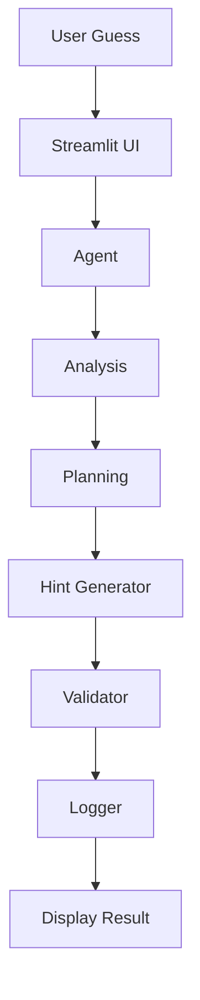

# 🎮 Game Glitch Investigator: Agent Edition

An AI agent that investigates, plans, and verifies its own hints in a number-guessing game — turning a debugging exercise into a small end-to-end agentic system.

## Original Project

This project extends **Game Glitch Investigator**, a Module 1-2 debugging exercise. The original goal was to take a broken, AI-generated Streamlit number-guessing game and fix it: the secret number reset on every submit, hints were sometimes reversed, and the game state wasn't tracked correctly. The original scope was purely corrective — find the bugs, refactor `check_guess` out of the UI code into `logic_utils.py`, and get a working game with passing pytest tests. That work is preserved in `reflection.md`.

## What's New: Agent Upgrade

This version adds a genuine multi-step **agentic workflow** on top of the fixed game. Instead of just comparing a guess to a secret number and returning a hint, every guess now goes through `GameAgent.investigate_guess()` (`agent.py`), which runs four sequential steps:

1. **Analyze** — describe the relationship between the guess and the secret
2. **Plan** — decide what to suggest to the player next
3. **Generate Hint** — produce the actual hint shown to the player
4. **Verify** — independently re-check the hint against the guess/secret relationship using `validator.py`, then log the full result via `logger.py`

This isn't a bolt-on demo — the Streamlit UI (`app.py`) uses the agent's output directly to drive game state, scoring, and win/loss detection. If the agent's investigation changes, the game's behavior changes with it.

## Architecture Overview

The system diagram is at [`diagrams/architecture.mmd`](diagrams/architecture.mmd) (Mermaid source):



**Data flow:** a player's raw guess is parsed and validated by the Streamlit UI, then handed to the Agent. The Agent runs Analysis and Planning steps, produces a Hint, and passes that hint to the Validator, which independently checks it's actually consistent with the guess/secret comparison (this is the guardrail — see below). Once verified, the result is logged to `logs/game_log.json`, and only then is it displayed back to the user. This matches the real call chain in `agent.py`'s `investigate_guess()` method.

## Setup Instructions

```bash
# 1. Install dependencies
pip install -r requirements.txt

# 2. Run the app
python -m streamlit run app.py

# 3. Run the unit tests
pytest

# 4. Run the reliability evaluation harness
python3 eval_harness.py
```

## Sample Interactions

**Input: secret=50, guess=75**
```json
{
  "analysis": "Guess is higher than the secret.",
  "plan": "Suggest a lower number.",
  "hint": "Too High",
  "verified": true
}
```

**Input: secret=50, guess=20**
```json
{
  "analysis": "Guess is lower than the secret.",
  "plan": "Suggest a higher number.",
  "hint": "Too Low",
  "verified": true
}
```

**Input: secret=50, guess=50**
```json
{
  "analysis": "Guess matches the secret.",
  "plan": "End game.",
  "hint": "Correct",
  "verified": true
}
```

In the running app, each of these steps is also displayed to the player under an "🤖 Agent Investigation" panel (Analysis / Plan / Verification), not just used internally.

## Reliability & Evaluation

The agent's `verify` step is a real guardrail — it independently recomputes whether the hint matches the guess/secret relationship, rather than trusting the hint-generation step. To confirm it actually catches errors:

| Input | Guardrail Check | Result |
|---|---|---|
| `validate_hint(secret=50, guess=75, hint="Too High")` — correct hint | Hint matches guess > secret | ✅ `True` (passes) |
| `validate_hint(secret=50, guess=75, hint="Too Low")` — wrong hint, simulating a bug | Hint contradicts guess > secret | ❌ `False` (correctly caught) |

**Evaluation harness** (`eval_harness.py`) runs the agent against 8 predefined cases:

```text
Case | Secret | Guess | Expected | Actual | Verified | Result
----------------------------------------------------------------------
   1 |     50 |    75 | Too High | Too High | True     | PASS
   2 |     50 |    20 | Too Low  | Too Low  | True     | PASS
   3 |     50 |    50 | Correct  | Correct  | True     | PASS
   4 |      1 |   100 | Too High | Too High | True     | PASS
   5 |    100 |     1 | Too Low  | Too Low  | True     | PASS
   6 |      1 |     1 | Correct  | Correct  | True     | PASS
   7 |     50 |    49 | Too Low  | Too Low  | True     | PASS
   8 |     50 |    51 | Too High | Too High | True     | PASS
----------------------------------------------------------------------
Summary: 8/8 cases passed (confidence score: 1.00)
```

**Unit test summary:**
```text
10 passed, 0 failed, 10 total
```

## Testing Summary

- 10/10 unit tests pass across `test_game_logic.py` and `test_agent.py`.
- 8/8 cases pass in the `eval_harness.py` reliability harness, confidence score 1.00.
- The validator was confirmed to *reject* a deliberately wrong hint, proving the guardrail does real work.
- What didn't work initially: the pre-agent version of this game had a bug where the secret number was silently converted to a string on alternating attempts. That was found through manual inspection, not automated testing — a known limitation described further in `model_card.md`.

## Design Decisions

- Kept the agent's reasoning steps separate and inspectable (analyze / plan / hint / verify as distinct methods) so each step can be tested and displayed independently.
- The verifier is independent of the hint generator — `generate_hint()` and `validate_hint()` both re-derive the answer from `secret` and `guess` separately, which is what makes the guardrail meaningful instead of circular.
- Finished the `logic_utils.py` refactor properly — all shared logic now lives in one place and `app.py` imports it.
- Logging is append-only JSON — simple and inspectable, though it wouldn't scale to concurrent players.

## Reflection

Building the agent layer on top of an already-debugged game made clear how much more upfront design a multi-step system needs compared to a single function. Building `eval_harness.py` to independently check the guardrail was probably the most useful part of the project. The full AI-collaboration reflection is documented in `model_card.md`.